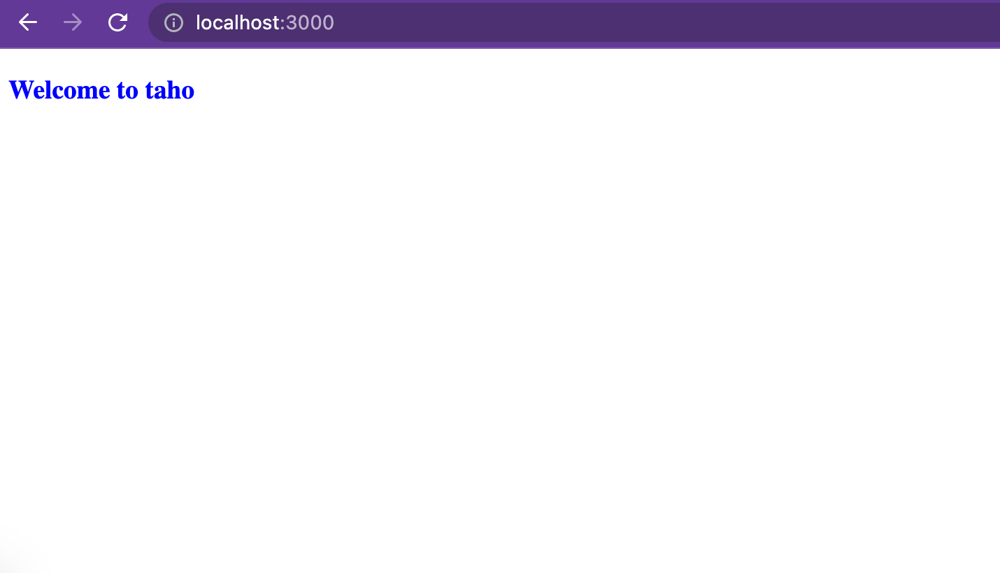
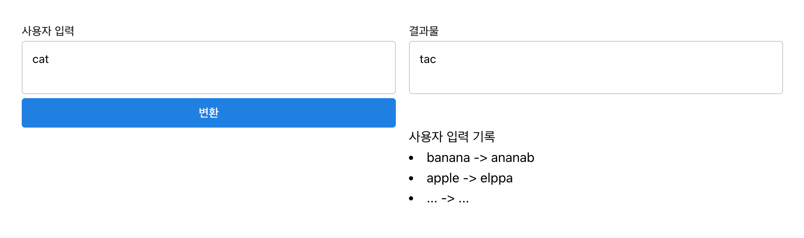

# Next.js 예시

## 1) 프로젝트 실행

```bash
npm run dev
# or
yarn dev
# or
pnpm dev
```

브라우저에서 링크 열기 [http://localhost:3000](http://localhost:3000)

## 2) 프로젝트 환경

1. next.js 14, react 18
2. typescript


## 3) 프로젝트 목표
1. textarea 두 개 배치. button 배치

2. 왼쪽 textarea에서 사용자 입력을 받기

   - [추가] 사용자 입력 validation (길이 제한, 포맷 제한)

3. 사용자가 제출 button을 누르면 사용자 입력을 거꾸로 뒤집어서 (예. cat -> tac) 오른쪽 textarea로 이동

   - [추가] 서버 `/api` 를 활용

4. 사용자 입력 기록 보여주기

5. 추가 기능
   1. 사용자 입력 기록에 좋아요

      - [추가] 좋아요 최대 한 번만

   2. 사용자 입력 기록 삭제

   3. 삭제 되돌리기 (undo) 기능

      - [추가] redo

      - [추가] 단축키 적용 (ctrl + z or cmd + z)

   4. 사용자 입력 textarea에서 단어 수 보여주기


**프로젝트 목표가 아닌 것**

1. css를 활용해서 화면 배치, UI를 개선하기 -> 정확한 동작에만 초점을 맞추기

2. 코드의 퀄리티 (코드 패턴, 모듈화, 커밋 로그 등) -> 빠른 시간 안에 아이디어를 구현하기

3. 모든 코드를 직접 짜기 -> 구글, 스택오버플로우, copilot, 복사&붙여넣기 사용 가능


## 4) 프로젝트 예상 결과물 

**Before**



**After**



## 5). (높은 확률로) 수정하게 될 파일

1. `pages/index.tsx`
2. [추가] `api/hello.ts`
