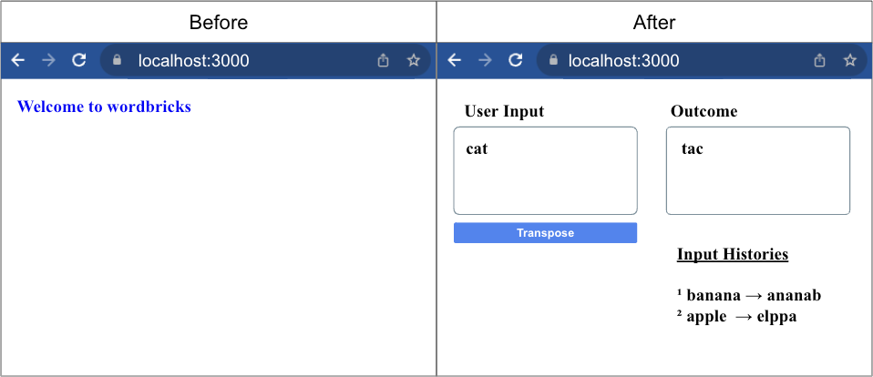

# Next.js Sample Task

## 1) Run project

```bash
npm run dev
# or
yarn dev
# or
pnpm dev
```

Open the link in your browser [http://localhost:3000](http://localhost:3000)

## 2) Project Environment

1. next.js 14, react 18
2. typescript

## 3) Objective

1. Place two 'textarea', and one 'button'

2. Receive the user input from the left textarea

   - [Advanced] Validate the user input (length, format) based on your own criteria

3. Return the reversed text (e.g., cat -> tac) in the right textarea when the user clicks the button

   - [Advanced] Use the server `/api`

4. Display input histories

5. Additional features

   1. Like button for the input text

      - [Advanced] Maximum one like per user

   2. Delete user input history

   3. Undo 'delete' action

      - [Advanced] Redo 'delete' action

      - [Advanced] Shortcut key (ctrl + z or cmd + z)

   4. Show word count below the textarea

**We do not evaluate the followings**

1. Improve UI using css -> We only care whether the feature works or not

2. Quality of code (Code pattern, modularization, commit logs... ) -> We want you to prioritize speed during this interview and not worry about anything else.

3. Writing all the code from scratch -> You can also utilize Google, Stack Overflow, Copilot, and copy-paste as needed.

## 4) Expected Outcomes



## 5). (Tips) You'll probably be editing the following pages

1. `pages/index.tsx`
2. [Advanced] `api/hello.ts`
